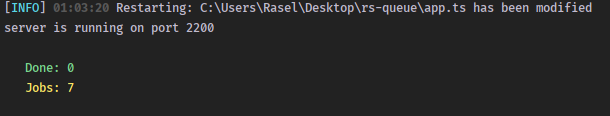
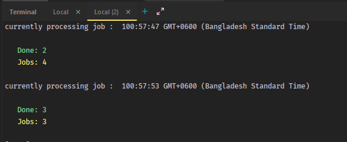

### RS-Queue

RS-Queue is a straightforward job queue that efficiently handles tasks in the background, safeguarding against job loss in case of server crashes or restarts. It effectively manages the queuing of tasks, ensuring their completion even in unpredictable server conditions.

### It has queue monitoring system, and follow event driven architecture.

