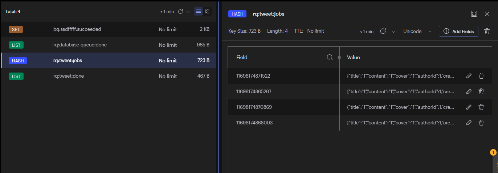
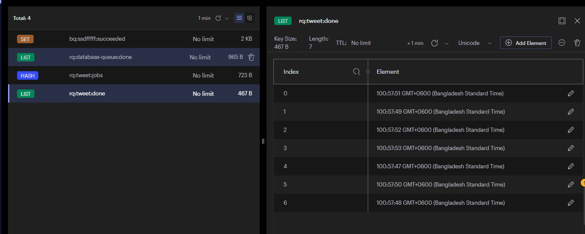

### RS-Queue

RS-Queue is a straightforward job queue that efficiently handles tasks in the background, safeguarding against job loss in case of server crashes or restarts. It effectively manages the queuing of tasks, ensuring their completion even in unpredictable server conditions.

### It has queue monitoring system, and follow event driven architecture.

```sql
drop table orders;
create table orders(
    id serial primary key,
    customer_id varchar,
    price double precision,
    product_id varchar,
    created_at timestamptz
)

```


### Pending Jobs

### Done Jobs
